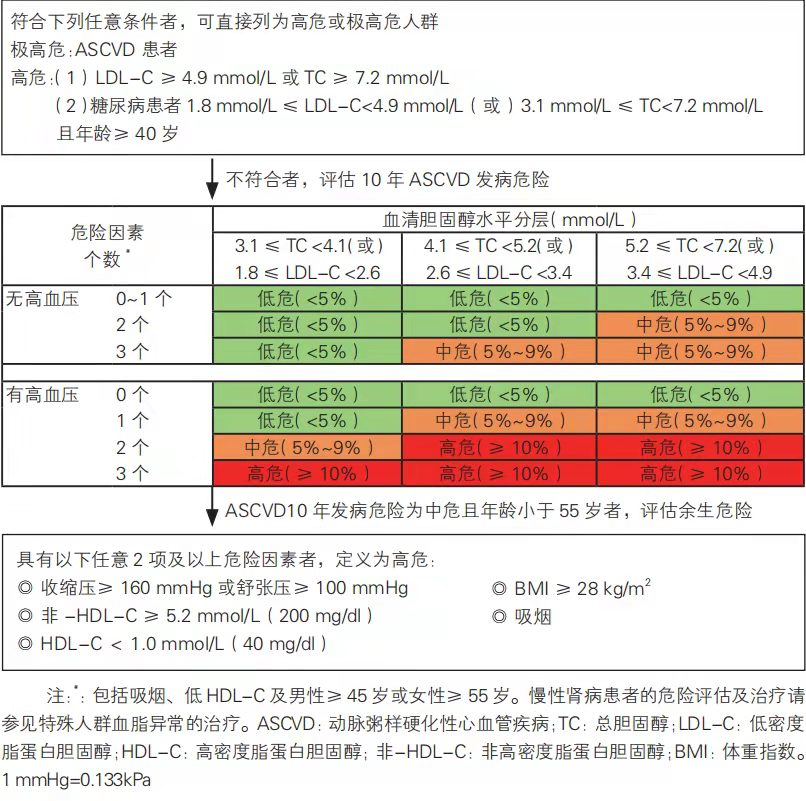

# 关于高血脂

最近在学习「得到」课程「高血脂医学课」，作者冯雪，以下是个人的学习摘抄笔记。

## 脂质的作用

高血脂准确说应该叫血脂异常。除了高密度脂蛋白胆固醇（用于清除血脂），其它都是升高了就对人体不好。

脂质的特别之处：

1. 不在身体的遗传体系内，都是由外部摄入。
2. 和身体的基调不相容。

脂质的功能：

1. **屏障功能**：决定细胞的骨架结构，区分开细胞。
2. **防御功能**：“脂肪酸衍生物”，包括前列腺素和血栓素。前列腺素调动免疫因子对抗病毒，产生炎症。血栓素发挥凝血功能。前列腺素可溶解血栓。
3. **沟通**：“类固醇化合物”，各种激素，受到外界刺激产生的物质，让身体感知到变化，并且做出反应。
4. **储存能量**：脂肪（甘油三酯），储存和供给人体能量。

## 脂质的代谢

载脂蛋白 + 脂质 = 血脂。

外源性血脂：吃进来的脂质 + 载脂蛋白。

内源性血脂：运送储藏在肝脏细胞、脂肪组织等自身的脂质 + 载脂蛋白。

**高血脂的危害，主要来自于内源性血脂，具体是看甘油三酯和低密度脂蛋白胆固醇。而高密度脂蛋白胆固醇，是高血脂的克星。**

## 高血脂相关指标

关键指标：低密度脂蛋白胆固醇（LDL-C），载脂蛋白 Apo-B。

甘油三酯与心脑血管风险不大，会增加糖尿病的风险。

危险的脂质：胆固醇、甘油三酯。

被B船运的胆固醇叫低密度脂蛋白胆固醇（LDL-C），A船运的叫高密度脂蛋白胆固醇（HDL-C）。

低密度脂蛋白胆固醇绝对危险值：4.9mmol/L 以上。绝对安全值：1.8mmol/L 以下。理想指标是3.4以下。

## 血脂影响因素

导致高血脂的第一个输入因素：长期吃过量的胆固醇。包括肥肉、蛋黄、动物内脏、鸡皮、黄油等非水产动物的油脂。

第二个输入因素：过多的碳水化合物。

第三：能量过剩。

输出需要高密度脂蛋白胆固醇，需要不饱和脂肪。需要摄入鱼肉、坚果、菜籽油、亚麻籽油等。

少量饮酒可以激发肝脏脂肪酶的活性。

**脂肪分布异常**：肚子大或两腿细。

多运动。

## 从高血脂到心梗

**第一步，外来入侵。**

1. 血脂本身变形。LDL-C遇到氧化应激的产物，容易被氧化变形。包括高盐、高油、高热量、睡眠不足、压力大、肥胖等应激产生的一些东西。变形后的LDL-C会在血管堆积，无法停靠到组织细胞。
2. 血管壁发生损伤：高血压高血糖容易让血管壁的细胞损伤。血脂容易在受损处堆积。

**第二步，免疫对抗。**

血脂堆积到血管壁，引起免疫系统攻击，吞噬细胞吞完脂蛋白球后形成泡沫细胞在血管壁聚集，形成动脉粥样硬化斑块的基础。

免疫系统会给斑块修修补补，戴上帽子。

**第三步，炎症爆发。**

随着炎症的发生，斑块破裂，炎症物质涌出，促进血液凝固，从而形成血栓，把血管堵住。心梗或者脑梗，就这样发生了。

幸运一点就是没有心梗，而是血管变狭窄，导致反复心绞痛，脑供血不足，进而导致心脏功能衰竭，神经功能减退。

## 治疗思路

三个心脑血管风险模型：

1. SCORE 模型。
2. 汇集队列风险方程。
3. China-PAR。中国人中的准确性最好。

[评估网站](https://www.cvdrisk.com.cn/ASCVD/Eval)

### 治疗标准

**极高危人群**

明确诊断冠心病、已经有心绞痛、心梗等情况的人。LDL-C 目标定在 1.8mmol/L 以下，或者是原有水平的50%。

**高危人群**

LDL-C大于4.9mmol/L 或者总胆固醇大于7.2mmol/L的，或者40岁以上的糖尿病，同时LDL-C在1.8mmol/L 以上。目标定为LDL-C 2.6mmol/L 以下，或者下降 30%以上。

**中低危险人群**

LDL-C小于 3.4mmol/L。

### 治疗流程

极高危：调整生活方式，服用药物治疗，使用强效的他汀。

高危：生活方式治疗方案，3~6个月后不能达到标准，就药物治疗。

中低危：生活方式治疗方案。

进一步评估：颈动脉超声，看颈动脉是否有斑块，如果有，那心脏有斑块的概率就很大。或者冠状动脉的CT，获取冠状动脉的钙化积分，积分大于100就要开启药物治疗。

可以做心脏的冠状动脉的增强CT和造影检查，但是有一定的损伤。

## 生活方式处方

生活方式治疗，是高血脂的根本性治疗，而且证据充足、疗效明确、没有争议。

**正面清单**

合理的饮食结构：碳水类食物占每日总能量的40%~60%，脂肪类食物占20%~30%，不要低于15%，其余是蛋白质。

饱和脂肪酸控制在7%以下，不饱和脂肪酸达到总能量的 15~20%。

饱和脂肪酸来自于猪牛羊肉、全脂牛奶、鸡蛋黄。大概是一个鸡蛋、一袋全脂牛奶、一两猪肉。尽量避开高胆固醇食品：内脏、主题、蚬子、蟹黄、鱿鱼和鲍鱼。肉制品要去皮去肥肉。

不饱和脂肪酸主要来自于鱼肉、坚果、植物油等。每天20~30g植物油、**一把坚果或黄豆、一到二两鱼肉，**尤其是深海鱼类如带鱼、黄花鱼、鲅鱼、三文鱼、鳕鱼、金枪鱼、秋刀鱼、海鳗鱼都可以。

增加膳食纤维，每天约20~30g。**大约1斤左右的蔬菜。秋葵、辣椒、竹笋、菜花、叶菜类纤维素含量都很高。**

**半斤左右的水果**，不要削皮不要榨汁。

谷物方面，用全谷物比如全麦、青稞、糙米、燕麦替代精米白面。

管理好身材，腰细、臀肥、腿粗。**每周不低于150分钟的中等强度有氧运动。**最好每天达到40~60分钟有氧训练结合力量训练。

长期喝茶，尤其是绿茶、普洱茶。可以改善肠道菌群，减少脂肪的吸收，加速胆汁对脂肪的外排。

**负面清单**

避免吃任何反式脂肪酸。不存在天然食物里，大多是零食，由植物油氢化获得。

不要抽烟。

不要大量饮酒。特别是甘油三酯升高的人。

